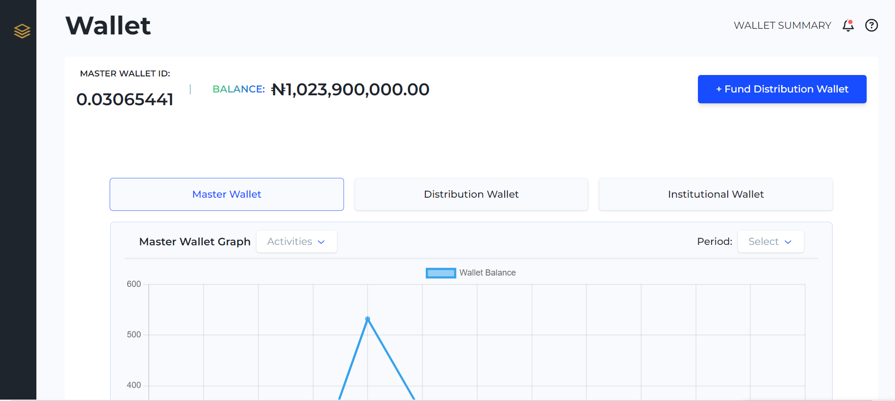
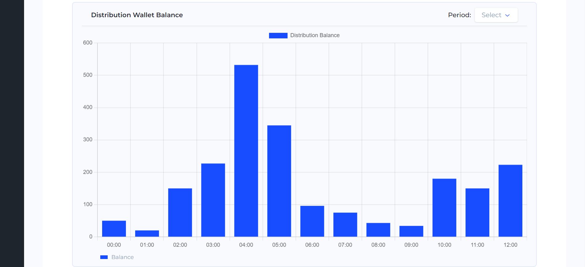
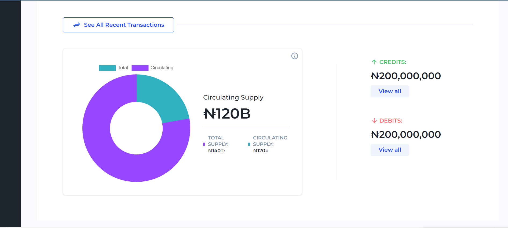

# My Wallet Dashboard Application

The Wallet Dashboard Application is a powerful and user-friendly tool that allows users to visualize and analyze their wallet balance and transactions through interactive charts and tables. This application is built using cutting-edge web technologies, including Next.js 13, Tailwind CSS, TypeScript, Radix UI primitive components, Chart.js, and React Icons. It follows the Atomic Design methodology to ensure a scalable and maintainable design system.

## Features

- **Interactive Charts:** View your wallet balance and transaction history through dynamically generated charts. Select different data options such as daily, monthly, or yearly to get a comprehensive overview of your financial activity.

- **Tabular Data:** Dive deep into your transaction details with organized and filterable tables. Search, sort, and filter transactions based on various criteria to find the information you need quickly.

- **Responsive Design:** The application is fully responsive, ensuring an optimal user experience across various devices and screen sizes.

- **Next.js 13:** Built with Next.js, the application takes advantage of server-side rendering (SSR) and optimized performance for seamless navigation and quick data loading.

- **Tailwind CSS:** The use of Tailwind CSS ensures consistent and efficient styling. Customize and extend the styles as needed to match your branding.

- **TypeScript:** The application is developed using TypeScript, providing robust type checking and improved code quality.

- **Radix UI Primitive Components:** Radix UI components are used to create a consistent and accessible user interface, enhancing the overall user experience.

- **Chart.js:** Interactive and visually appealing charts are powered by Chart.js, enabling users to grasp trends and patterns at a glance.

- **React Icons:** Enhance the application's visual appeal with a wide range of customizable icons from React Icons.

## Atomic Design Methodology

The Wallet Dashboard Application is meticulously designed following the Atomic Design methodology. This approach organizes UI components into five distinct levels based on their complexity and reusability:

1. **Atoms:** Basic building blocks such as buttons, inputs, and icons.

2. **Molecules:** Small, functional components composed of multiple atoms, forming more complex UI elements like form controls.

3. **Organisms:** Larger components that combine molecules and atoms to create distinct sections of the UI, such as transaction lists or balance cards.

4. **Templates:** High-level wireframes that provide the structure for entire pages, arranging organisms in a coherent layout.

5. **Pages:** The final product, where templates are populated with actual content and data.

By adhering to the Atomic Design methodology, the application promotes consistency, scalability, and easier maintenance of its user interface.

## Getting Started

Follow these steps to get the Wallet Dashboard Application up and running on your local machine:

1. Clone the repository: `git clone https://github.com/BlessingOkonkwo/my-wallet`

2. Navigate to the project directory: `cd my-wallet`

3. Install dependencies: `npm install`

4. Start the development server: `npm run dev`

5. Open your web browser and navigate to `http://localhost:3000` to access the application.

## Configuration

To configure the application and customize its behavior, you can edit the following files:

- `src/config.ts`: Modify this file to set up any configuration options, such as API endpoints or default chart settings.

## Contributing

Contributions are welcome! To contribute to the Wallet Dashboard Application, follow these steps:

1. Fork the repository.

2. Create a new branch for your feature or bug fix: `git checkout -b feature-name`

3. Make your changes and commit them: `git commit -m "Add new feature"`

4. Push your changes to your fork: `git push origin feature-name`

5. Create a pull request on the main repository.

## Contact

For any inquiries or support, please contact me at theblessingokonkwo@gmail.com.

---

Start exploring your wallet data like never before with the Wallet Dashboard Application. Gain valuable insights, make informed financial decisions, and stay in control of your finances.

